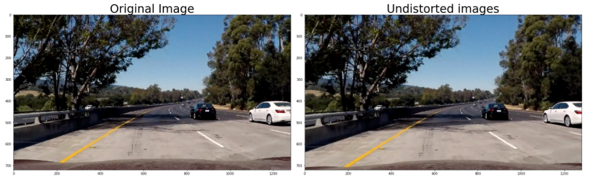
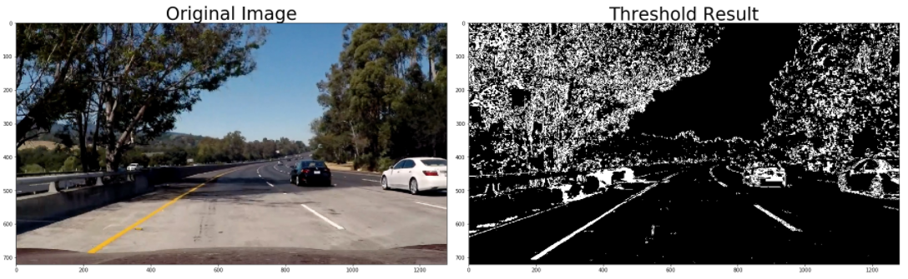
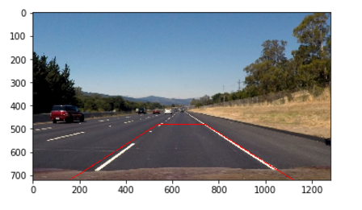
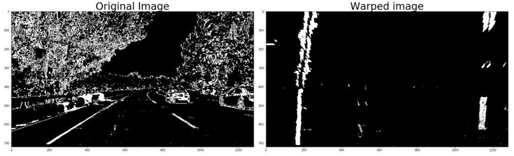
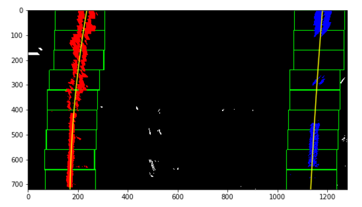
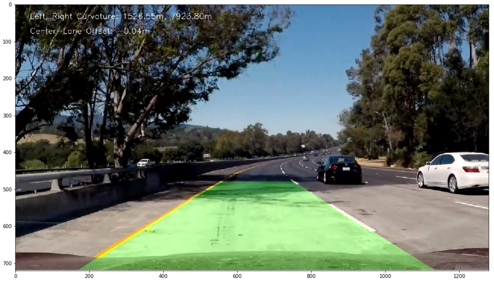
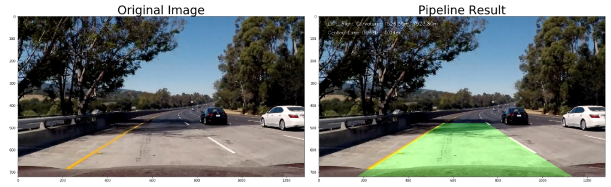
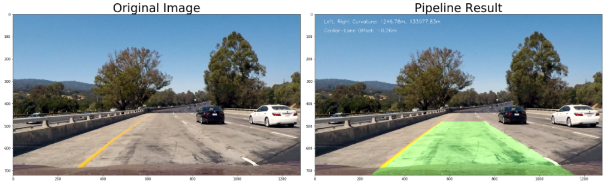
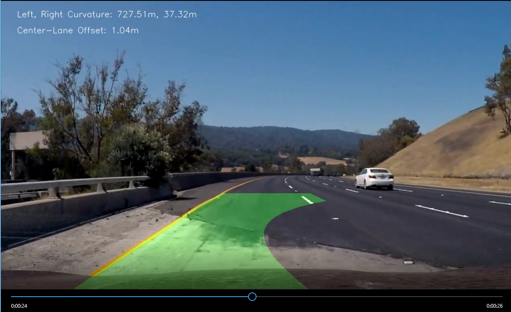

## Advanced Lane Finding Project

The goals / steps of this project are the following:

* Compute the camera calibration matrix and distortion coefficients given a set of chessboard images.
* Apply a distortion correction to raw images.
* Use color transforms, gradients, etc., to create a thresholded binary image.
* Apply a perspective transform to rectify binary image ("birds-eye view").
* Detect lane pixels and fit to find the lane boundary.
* Determine the curvature of the lane and vehicle position with respect to center.
* Warp the detected lane boundaries back onto the original image.
* Output visual display of the lane boundaries and numerical estimation of lane curvature and vehicle position.

---

### Camera Calibration

* **Prepare the objpoints and imgpoints needed for camera calibration**
* **Calculate camera matrices (mtx) and distortion coefficients (dist). Mtx and dist are needed to transform 3D image into 2D image.**
* **Test: correct distortion using camera matrices and distortion coefficients.**

I start by preparing "object points", which will be the (x, y, z) coordinates of the chessboard corners in the world. Here I am assuming the chessboard is fixed on the (x, y) plane at z=0, such that the object points are the same for each calibration image.  Thus, `objp` is just a replicated array of coordinates, and `objpoints` will be appended with a copy of it every time I successfully detect all chessboard corners in a test image.  `imgpoints` will be appended with the (x, y) pixel position of each of the corners in the image plane with each successful chessboard detection.  

I then used the output `objpoints` and `imgpoints` to compute the camera calibration and distortion coefficients using the `cv2.calibrateCamera()` function.  I applied this distortion correction to the test image using the `cv2.undistort()` function and obtained this result: 


Test on a road image, the result is not obvious.


### Pipeline (single images)

#### 1. Provide an example of a distortion-corrected image.



#### 2. Describe how (and identify where in your code) you used color transforms, gradients or other methods to create a thresholded binary image.  Provide an example of a binary image result.

* **Convert RGB into HLS.**
* **Apply L channel threshold using Sobel X.**
* **Apply S channel threshold.**
* **Combine two binary threshold images.**

    

#### 3. Describe how (and identify where in your code) you performed a perspective transform and provide an example of a transformed image.

The code for my perspective transform includes a function called `perspective_transform()`.  The function takes an image (`img`) as input , as well as source (`src`) and destination (`dst`) points.  I chose the hardcode the source and destination points in the following manner:

```python
img_size = (img.shape[1], img.shape[0])
centerX = img_size[0]//2
top_offset = 100
bottom_offset = 480

# For source points I'm grabbing the outer four detected corners
src = np.float32([(centerX-top_offset, 480),
                  (centerX+top_offset, 480),
                  (centerX+bottom_offset,img_size[1]),
                  (centerX-bottom_offset,img_size[1])])
# For destination points, I'm arbitrarily choosing some points to be
dst = np.float32([(centerX-bottom_offset, 0),
                  (centerX+bottom_offset, 0),
                  (centerX+bottom_offset,img_size[1]),
                  (centerX-bottom_offset,img_size[1])])
```

This resulted in the following source and destination points:

| Source        | Destination   | 
|:-------------:|:-------------:| 
| 540, 480      | 160, 0        | 
| 740, 480      | 1120, 0      |
| 1120, 720     | 1120, 720      |
| 160, 720      | 160, 720        |

Show source points on a image:

 

I verified that my perspective transform was working as expected by drawing the `src` and `dst` points onto a test image and its warped counterpart to verify that the lines appear parallel in the warped image.

 


#### 4. Describe how (and identify where in your code) you identified lane-line pixels and fit their positions with a polynomial?

* **Identify Right and Left line by histogram.**
* **Apply Sliding window method to find the best fit lines.**
* function: find_lane()

 

#### 5. Describe how (and identify where in your code) you calculated the radius of curvature of the lane and the position of the vehicle with respect to center.

**Mesuring Curvature**:
* Calculate Radious of a Curve f(y) = Ay^2 + By + C.
* Radius for left and right line.
* Convert from pixel space to real work space which is meter.

**Calculate the Offset**:
* Find the lane center.
* Find the image center (X midpoint).
* distance = image center - lane center
* Convert from pixel space to real work space which is meter.

#### 6. Provide an example image of your result plotted back down onto the road such that the lane area is identified clearly.

I implemented this step in the function `map_lane()`.  Here is an example of my result on a test image:

 

#### Pipeline testing - created a pipeline() function
Pipeline test on different test images:
 
 
 

---

### Pipeline (video)

#### 1. Provide a link to your final video output.  Your pipeline should perform reasonably well on the entire project video (wobbly lines are ok but no catastrophic failures that would cause the car to drive off the road!).

Here's a [link to my video result](project_video.mp4)

---

### Discussion

#### 1. Briefly discuss any problems / issues you faced in your implementation of this project.  Where will your pipeline likely fail?  What could you do to make it more robust?

Here I'll talk about the approach I took, what techniques I used, what worked and why, where the pipeline might fail and how I might improve it if I were going to pursue this project further.  
* Applying sliding window search to find fit line for each frame. It is computitionally expensive. We can do skip sliding window if the fit line is already detected in the previous frame.
* Drawn lanes are not smooth. 
* Problems occur when background change (see below example).  I think:
  * optimize thresholds such as adding magtitude gradient threshold and direction threshold.
  * adjust threshold values
  * apply skipping sliding window, may be helpful.

 
 
